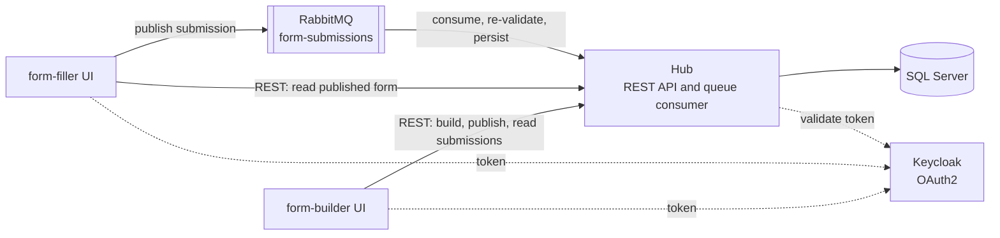

# PhieuFlow

## Preface

I work as a platform architect. Most of that work is decisions, not features. The
decisions live in wiki pages and pull-request comments. They rarely fit in a
screenshot. PhieuFlow gives a few of them somewhere to stand.

The system is small on purpose. It is a form builder, a form filler, and a Hub
that owns the database. It has one synchronous CRUD path, one asynchronous
boundary, an identity provider, and a message queue. Each decision is recorded as
an ADR in [`docs/adr/`](docs/adr/). The design draws on my
.NET career and my work on platform architecture, not on any single framework or
book.

I built the system with AI assistance, mostly Claude Code. The tool drafts. I
review. Every decision that mattered went through an ADR that I approved based on my years of experience with .Net.

## Overview

PhieuFlow is a distributed form platform. It has three services: a form-builder
UI, a form-filler UI, and a Hub that owns the database. This repository is a
portfolio piece. It shows a set of deliberate architecture decisions, and it
records each decision as an ADR in [`docs/adr/`](docs/adr/).

## What this project demonstrates

- One synchronous CRUD path and one deliberate asynchronous boundary in the same
  system (ADR 0001).
- OAuth2 client-credentials authentication between services, with authorization
  by scope claim (ADR 0005).
- Form versioning that protects submitted answers from later structural edits
  (ADR 0007).
- Validation that runs on the client for speed and on the server as the
  authority (ADR 0002, 0010, 0011).
- A durable quorum queue with a dead-letter path and an inbox table for
  idempotent processing (ADR 0008, 0009).
- Local orchestration with .NET Aspire. Kubernetes is the documented deployment
  target (ADR 0004).
- A layered test strategy: unit tests, integration tests against a real SQL
  Server database, and browser end-to-end tests (ADR 0006).

## Architecture



The form-builder and the form-filler never touch the database. The Hub owns it.
Every call to the Hub carries an OAuth2 bearer token. The Hub checks a scope
claim on every endpoint.

| Project | Role |
| --- | --- |
| `PhieuFlow.FormBuilder` | Blazor UI to build, publish, and review forms. Calls the Hub over REST. |
| `PhieuFlow.FormFiller` | Blazor UI to fill and submit a published form. Reads over REST. Submits over RabbitMQ. |
| `PhieuFlow.Hub` | REST API for form management and read-back. Also the background consumer for the submission queue. Owns all authorization. |
| `PhieuFlow.Hub.Contracts` | Shared DTOs and two validators: the publish rules and the answer rules. No infrastructure dependencies. |
| `PhieuFlow.Core` | Domain entities. |
| `PhieuFlow.Persistence` | EF Core `DbContext`, entity configuration, migrations, repositories, and the version reconciler. |
| `PhieuFlow.Ui` | Shared Blazor component library. Both UIs reference it. |
| `PhieuFlow.MigrationService` | Applies the EF Core migrations at startup. |
| `PhieuFlow.SeedService` | Loads sample forms. Local development only. |
| `PhieuFlow.ServiceAuth` | Requests and caches client-credentials tokens for the two UIs. |
| `PhieuFlow.ServiceDefaults` | Shared Aspire configuration: health checks, telemetry, and resilience. |
| `PhieuFlow.AppHost` | .NET Aspire orchestration for every service and container. |

## Technology

- .NET 10 and C#. Every project targets `net10.0`.
- ASP.NET Core Minimal APIs for the Hub.
- Blazor with the interactive server render mode for both UIs.
- .NET Aspire 13.5 for local orchestration.
- Entity Framework Core with SQL Server.
- RabbitMQ for the submission queue.
- Keycloak for the local OAuth2 identity provider.
- Tailwind CSS v4 for styles.
- Serilog for logs. OpenTelemetry through the Aspire service defaults.
- xUnit, AwesomeAssertions, and Playwright for tests.

## Architecture decisions

Each record is a numbered Markdown file in [`docs/adr/`](docs/adr/).

| ADR | Decision |
| --- | --- |
| [0001](docs/adr/0001-sync-form-management-async-submission.md) | Form management is synchronous REST. Form submission is asynchronous over RabbitMQ. This is the one deliberate async boundary. |
| [0002](docs/adr/0002-submission-validation-and-staleness.md) | The form-filler validates against its loaded copy for UX. The Hub re-validates on consume and stays the authority. |
| [0003](docs/adr/0003-shared-ui-library-and-tailwind.md) | Shared components live in a Razor Class Library. One Tailwind build runs at the solution root. |
| [0004](docs/adr/0004-aspire-local-orchestration-kubernetes-deployment.md) | .NET Aspire orchestrates the local run. Kubernetes is the deployment target through `aspire publish`. |
| [0005](docs/adr/0005-service-to-service-authentication.md) | Services authenticate to the Hub with the OAuth2 client-credentials flow against Keycloak. |
| [0006](docs/adr/0006-e2e-testing-with-playwright.md) | End-to-end tests use Playwright through `Aspire.Hosting.Testing`. |
| [0007](docs/adr/0007-form-versioning-for-published-forms.md) | Publishing locks a form version. The next edit forks a new draft version. |
| [0008](docs/adr/0008-rabbitmq-submission-queue.md) | The transport is one durable quorum queue, `form-submissions`, with a shared name constant and JSON message framing. |
| [0009](docs/adr/0009-submission-consumer-topology-and-idempotency.md) | A `BackgroundService` in the Hub consumes the queue with manual ack, a dead-letter exchange, a delivery limit, and an inbox table. |
| [0010](docs/adr/0010-server-side-submission-revalidation.md) | The Hub consumer re-validates each submission against the published version. An invalid message goes to the dead-letter queue. |
| [0011](docs/adr/0011-client-side-pre-publish-validation.md) | The form-builder runs the publish rules locally before it calls the Hub. The Hub still validates on the real publish. |

## Prerequisites

### .NET SDK 10.0 or later

Every project targets `net10.0`. The AppHost builds with `Aspire.AppHost.Sdk`
13.5.2. Aspire restores as normal NuGet packages. You do not need the separate
`aspire` CLI. `AspireUseCliBundle` is off in
[`PhieuFlow.AppHost.csproj`](src/PhieuFlow.AppHost/PhieuFlow.AppHost.csproj).

### Docker Engine, running, with BuildKit and buildx

Aspire 13.5 builds a proxy image with `docker build --progress=...`. The old
Docker builder does not accept the `--progress` flag. Docker Desktop and Docker
CE include buildx. The Ubuntu `docker.io` package does not. Install buildx
separately:

```
sudo apt-get install docker-buildx
docker buildx version
```

Your user account must be able to reach the Docker daemon. Add the account to
the `docker` group, or use rootless Docker. SQL Server, RabbitMQ, and Keycloak
run as containers. Keep about 4 GB of RAM free for them.

### ASP.NET Core HTTPS development certificate

Trust the certificate one time:

```
dotnet dev-certs https --trust
```

### Node.js 20 or later and npm

Both UIs build their CSS with Tailwind CSS v4. Run `npm install` one time.
`dotnet build` runs `npm run build:css` before it builds each UI. The output
goes to `wwwroot/css/tailwind.generated.css` in each UI project. For live CSS
updates during work on the form-builder, run `npm run watch:css`.

### Chromium, for the end-to-end tests only

Playwright needs a headless Chromium. The test fixture installs it on the first
run. The same run pulls the Keycloak image. To install Chromium manually, you
need PowerShell (`pwsh`):

```
pwsh tests/PhieuFlow.Tests.E2E/bin/Debug/net10.0/playwright.ps1 install chromium
```

## Run the system locally

```
dotnet run --project src/PhieuFlow.AppHost
```

Aspire starts SQL Server, RabbitMQ, Keycloak, the migration service, the seed
service, the Hub, the form-builder, and the form-filler. The Aspire dashboard
shows every service URL and every log. Docker must run first. See
[Prerequisites](#prerequisites).

## Identity provider

Every call to the Hub uses an OAuth2 client-credentials token from Keycloak
(ADR 0005). The AppHost runs Keycloak as a container. It imports the realm from
[`phieuflow-realm.json`](src/PhieuFlow.AppHost/realms/phieuflow-realm.json) at
startup. A fresh clone has an identical local identity provider. No manual admin
steps are needed.

The realm defines:

- realm `phieuflow`.
- client `form-builder`. It is confidential and uses a service account. Default
  scopes: `forms:read` and `submissions:read`. Optional scopes: `forms:write`
  and `submissions:write`. Development secret: `form-builder-dev-secret`.
- client `form-filler`. It is confidential and uses a service account. Default
  scope: `published-forms:read`. Development secret: `form-filler-dev-secret`.
- an audience mapper that adds `phieuflow-hub` to the token.

Aspire assigns the Keycloak URL at runtime. It passes the URL to the Hub and
both UIs as `Keycloak__Authority`. The Hub validates tokens with the standard
JWT bearer middleware in ASP.NET Core. It authorizes each endpoint by the scope
claim.

To request a token manually, copy the Keycloak URL from the Aspire dashboard:

```
curl -sk -X POST <keycloak-url>/realms/phieuflow/protocol/openid-connect/token \
  -d grant_type=client_credentials \
  -d client_id=form-builder -d client_secret=form-builder-dev-secret \
  -d 'scope=forms:read forms:write'
```

The committed secret, `sslRequired=none`, `RequireHttpsMetadata=false`, and the
accept-any-certificate backchannel toggle are for local development only. A real
deployment sets a fixed `Keycloak:Authority` with a trusted certificate and its
own secret.

## Tests

### Unit tests

[`tests/PhieuFlow.Tests.Unit`](tests/PhieuFlow.Tests.Unit) covers the pure
logic: the edit-model mappers, the form-editor and list sessions, the autosave
controller, the version reconciler, the two validators, and the token helpers.
No Docker.

```
dotnet test tests/PhieuFlow.Tests.Unit
```

### Integration tests

[`tests/PhieuFlow.Tests.Integration`](tests/PhieuFlow.Tests.Integration) has two
tiers. One command runs both:

```
dotnet test tests/PhieuFlow.Tests.Integration
```

- `integration-sql` runs the Hub endpoints and the submission handler against a
  real SQL Server database. Aspire starts the database. `MigrationService`
  applies the production migration chain. The Hub runs in process. Authentication
  is stubbed. The broker is not started. Needs Docker.
- `integration-auth` runs the auth pipeline (`HubAuthorizationTests`): the Hub in
  process, an offline-validated JWT, and in-memory SQLite. No Docker.

Run only the auth tier:

```
dotnet test tests/PhieuFlow.Tests.Integration --filter "FullyQualifiedName~HubAuthorizationTests"
```

### End-to-end tests

[`tests/PhieuFlow.Tests.E2E`](tests/PhieuFlow.Tests.E2E) drives a real browser
against the full Aspire topology with Playwright (ADR 0006). The suite covers
form building, form versioning, service authentication, and the full
build-fill-submit flow across the RabbitMQ boundary. Needs Docker.

```
dotnet test tests/PhieuFlow.Tests.E2E
```

Test names follow the convention in
[`CLAUDE.md`](CLAUDE.md#testing-conventions):
`Test<Operation>_When_<condition>_Should_<outcome>`.

## Repository layout

| Path | Contents |
| --- | --- |
| `src/` | The twelve service and library projects. |
| `tests/` | The unit, integration, and end-to-end test projects, and the minimal Aspire host the integration tests share. |
| `docs/adr/` | The Architecture Decision Records. |
